## Hello, World ! 👋                                                          

                                                                                                      
👻 I'm Haonan, a Ph.D. student of Center for Future Media at UESTC. 
- 🦾 Python / C++ / Jupyter / Pytorch
- 🤔 LLM-based Agents / Vision&Language / Multimodal Learning
- 🌱 Attending courses & doing research at UESTC
- 🍙 Homepage: [`Link`](https://zchoi.github.io/)
- 🙋‍♂️ CV : [`Link`](https://zchoi.github.io/assets/cv_haonanzhang_0716.pdf) (Last updated: 2026.7)

***
<!--- 🔑 GPG Key : [`E1FB968577635BDF`](https://github.com/zchoi.gpg) -->
$\mathcal{Life\ isn't\ long\ enough\ for\ love\ and\ art. \ ——《The\ Moon\ and\ Sixpence》}$

<!--  -->
<!--  -->

